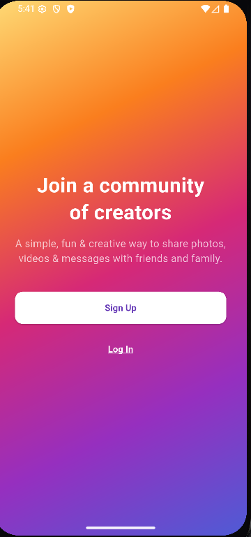
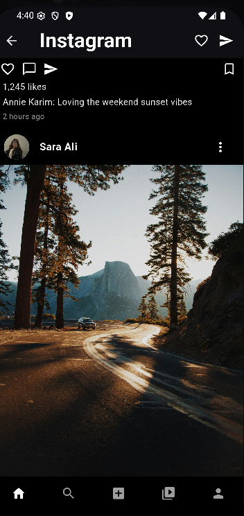
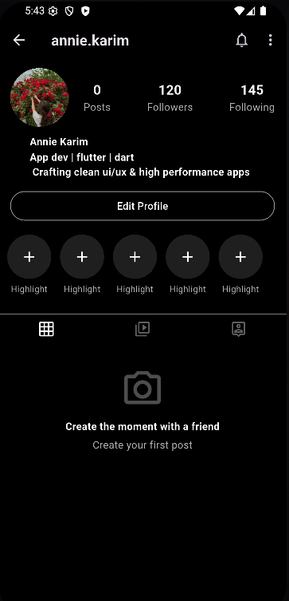

# Instagram UI Clone (Flutter)

A clean and responsive *Instagram UI Clone* built using the Flutter framework.  
This project is designed purely for *UI practice* and *portfolio showcasing* — no backend integration yet.

##  Features

- Splash Screen
- Login Screen
- Home Feed UI
- Story Section
- Profile Screen
- Bottom Navigation Bar
- Responsive layout using Flutter widgets

##  Screenshots

| Splash Screen | Login Screen |             Home (Feed)              | Home (Posts) | Profile Screen |
|:-------------:|:------------:|:------------------------------------:|:------------:|:--------------:|
|  |  |  |  |  |

##  How to Run

1. Clone the repository
2. Run flutter pub get
3. Launch on emulator or real device
4. Explore the complete Instagram-style UI!

##  Note

This is a *UI-only Flutter clone* for learning and showcasing purposes.  
There is no backend authentication, storage, or real-time updates implemented.

 *Feel free to star ⭐ this repo if it helps*