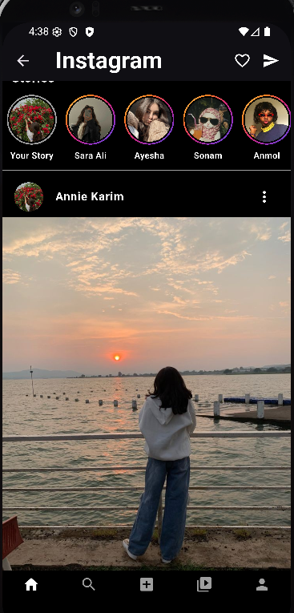

#  Instagram UI Clone (Flutter)

A clean and responsive *Instagram UI Clone* built using Flutter framework.  
This project is purely for UI practice and portfolio showcase — no backend integration yet.

##  Features:
- Login Screen
- Home Feed Screen
- Story View
- Bottom Navigation Bar
- Profile Screen
- Clean responsive UI layout using Flutter widgets

##  Screenshots:

| Login Screen | Home Screen |
|:------------:|:------------|
|  |  |

##  How to Run:
1. Clone the repository  
2. Run flutter pub get  
3. Launch on emulator or real device  
4. Enjoy exploring the UI

##  Note:
This is a UI-only clone for learning and portfolio purposes — no backend functionality included.

